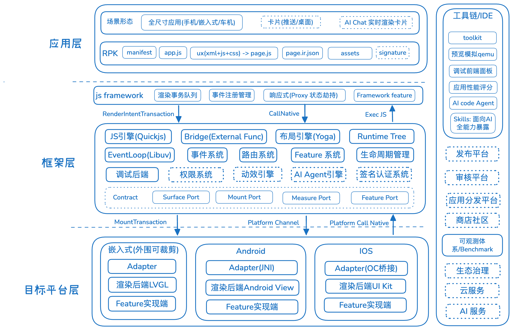

# Nyrax · QuickApp Kit

**One core, any platform.**
A full-stack, multi-platform solution for cross-platform quick apps.

*Nyrax is the runtime engine at the heart of QuickApp Kit — the Core is platform-independent and open to any platform; the official engine has already wired in three targets: Android · iOS · embedded LVGL.*

[简体中文](./README.zh-CN.md)

---

## What it is

QuickApp Kit is a full-stack, multi-platform quick-app framework:

**JS Runtime + platform-independent C++ Core + three rendering backends (Android / iOS / embedded LVGL) + a build Toolkit + an observability/benchmark suite.**

The Core is platform-independent and open for any platform to attach; the official engine has already wired three backends onto the **same Core**, all running real RPK packages.

- ✅ **Android / iOS** — running on real devices
- ✅ **Embedded** — verified on real hardware (**ESP32-S3-N16R8**)

## Architecture

  

## Design

- **Microkernel + trimmable periphery** — a stable microkernel (bridge / render / event / lifecycle / tree / transaction); the periphery is contract-based, composable and trimmable; clean, even layering across boundaries.
- **Platform-independent C++ Core** — core logic pushed down and consolidated into the Core, zero platform leakage; the Platform Port + Adapter mechanism attaches any platform (LVGL / Android / iOS already wired in as rendering backends).
- **Single authoritative Runtime Tree** — the Core owns the tree and layout (Yoga), NodeID-driven, no old/new dual-tree full diff; local-update cost stays independent of tree size.
- **JSON-free bridge** — external-function direct calls, no per-call JSON serialization; platform side is Android = JNI / iOS = ObjC++ / LVGL = in-process. Render pipeline: NodeID addressing + transaction-driven.
- **Isomorphic boundaries** — all Core ports (JS / Platform) share one shape: `post(typed message) → EnqueueResult`; clean, even, predictable and composable.
- **Swappable core parts** — key parts (QuickJS / Yoga) depend on abstract ports (dependency inversion).
- **Toolkit** — DSL → Page IR → RPK compile / inspect / run, with a built-in benchmark & observability suite.

## Repositories

| Repo | Role |
|---|---|
| [quickapp-runtime-core](https://github.com/quickapp-kit/quickapp-runtime-core) | Platform-independent C++ kernel |
| [quickapp-runtime-js](https://github.com/quickapp-kit/quickapp-runtime-js) | Framework JS-side runtime |
| [quickapp-runtime-android](https://github.com/quickapp-kit/quickapp-runtime-android) | Android rendering backend |
| [quickapp-runtime-ios](https://github.com/quickapp-kit/quickapp-runtime-ios) | iOS rendering backend |
| [quickapp-runtime-lvgl](https://github.com/quickapp-kit/quickapp-runtime-lvgl) | LVGL rendering backend |
| [quickapp-embedded](https://github.com/quickapp-kit/quickapp-embedded) | Embedded targets by hardware (real-device integration) |
| [quickapp-toolkit](https://github.com/quickapp-kit/quickapp-toolkit) | Build tool (DSL → RPK) |
| [quickapp-benchmark](https://github.com/quickapp-kit/quickapp-benchmark) | Observability & benchmark suite |
| [quickapp-examples](https://github.com/quickapp-kit/quickapp-examples) | Sample apps & fixtures |

---

MIT Licensed · Built by <a href="https://github.com/BlueStoneQ">BlueStoneQ</a>

